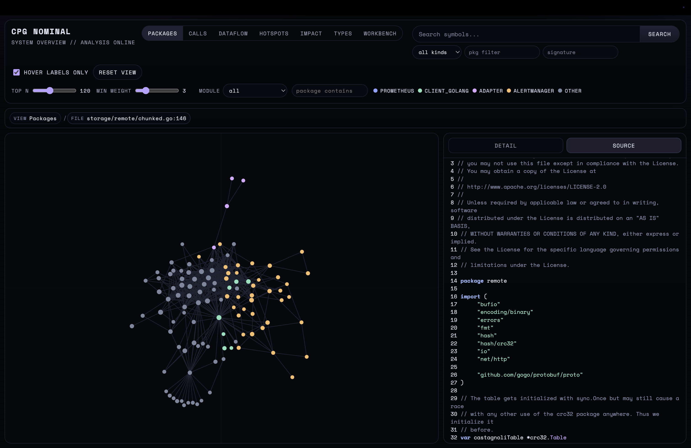

# CPG IDE



## Что это сейчас
Это функциональный прототип. Направление уже видно, но проекту еще нужна полировка в нескольких итерациях: не все сценарии работают стабильно. На прототип потрачено порядка 8 часов. 3-5 параллельных агентских сессий, максимальная автоматизация процесса из-за сжатых сроков.

## Как шла разработка (и почему именно так)
Задача делалась в условиях ограниченного времени и неполного контекста по будущим пользователям. Поэтому подход был практичный:
- Сначала собрать рабочий end-to-end контур (Docker + backend + frontend + базовый graph flow).
- Затем закрыть самые ценные пользовательские сценарии (Packages, Calls, Dataflow, переход в Source).
- После этого стабилизировать запуск и добавить базовую навигацию/состояния интерфейса.

Такой порядок выбран, чтобы быстро получить демонстрируемый результат и проверить направление, а не идеально отполировать отдельные части.

## Layout
- Дизайн-референсы для визуальной части подбирались вручную на [variant.com](https://variant.com/).
- Сверху: toolbar с режимами и базовыми контролами.
- Под ним: Context Trail для навигации по текущему контексту.
- В центре: интерактивный граф (узлы, ребра, подсветка связей).
- Справа: resizable боковая панель с вкладками:
  - **Detail** — информация по выбранному узлу/режиму.
  - **Source** — просмотр исходного кода с подсветкой синтаксиса.

## Что уже умеет
- Карта зависимостей пакетов (`Packages`).
- Граф вызовов функций (`Calls`).
- Срезы dataflow вперед/назад (`Dataflow`).
- Быстрые аналитические режимы (`Hotspots`, `Impact`, `Types`).
- SQL Workbench по встроенным запросам (`Workbench`).
- Поиск символов и переходы в исходный код.

## Что пока сыро
- Есть нестабильные пользовательские сценарии на краях данных.
- Не везде аккуратно обработаны loading/empty/error состояния.
- Некоторые переходы между режимами еще требуют UX-полировки.

## Проверка и доработка интерфейса
- Тестирование проводилось комбинированно: часть сценариев вручную, часть — через Playwright MCP.
- По итогам проходов дорабатывались интерфейсные детали: навигация, читаемость панелей и поведение состояний в пользовательских сценариях.

## Что можно улучшить
- Повысить стабильность сложных сценариев.
- Улучшить обработку ошибок и понятность сообщений в UI.
- Подтянуть производительность на больших подграфах.
- Добавить больше «быстрых» сценариев для первого знакомства с системой.

## Важно при запуске
Первый запуск тяжелый: идет генерация большой CPG-базы, это может занять 10–20+ минут.

Если памяти не хватает, `init` может завершиться с `exit 137` (OOM).

Текущий профиль по умолчанию в Docker:
- `GOMEMLIMIT=8GiB`
- `GOGC=60`
- `GOMAXPROCS=4`

Если машина слабее, используйте более безопасный профиль:

```bash
CPG_GOMEMLIMIT=2500MiB CPG_GOGC=20 CPG_GOMAXPROCS=1 docker compose up --build
```

Для комфортной первой сборки обычно нужно выделить Docker Desktop не меньше 10–12 GB RAM.

## Техническая справка (кратко)
### Стек и архитектура
- Backend: Go 1.25+, read-only HTTP API поверх SQLite CPG, тяжелые вычисления и ограничения графа на сервере.
- Frontend: React + TypeScript + Vite, визуализация на `react-force-graph-2d`, graph-first layout.
- Infra: `docker-compose` с сервисами `init` (one-shot генерация `/data/cpg.db`) и `app` (backend + собранный frontend).

### Быстрый старт

```bash
docker compose up --build
```

Открыть:
- [http://localhost:8080](http://localhost:8080)

### Первый запуск и ресурсы
- Порт можно переопределить:

```bash
APP_PORT=18080 docker compose up --build
```

- Профиль для слабой машины:

```bash
CPG_GOMEMLIMIT=2500MiB CPG_GOGC=20 CPG_GOMAXPROCS=1 docker compose up --build
```

### Локальный запуск без Docker

```bash
make local-generate
make run-local
```

Открыть:
- Frontend: [http://localhost:5173](http://localhost:5173)
- Backend API/static: [http://localhost:8080](http://localhost:8080)

### Производительность и масштаб
- Ограничения глубины/объема графа на API-уровне.
- Кэширование source/outline на фронте.

### Структура репозитория
- `cmd/cpg-serve` — backend API server.
- `internal/server` — HTTP handlers и SQL-логика.
- `frontend/` — React SPA.
- `scripts/init-cpg.sh` — генерация CPG для Docker `init`.
- `docker-compose.yml` — запуск `init + app`.

## Продуктовые артефакты
- `docs/p1-discovery/P1_DISCOVERY.md`
- `docs/p2-one-pager-prd/P2_ONE_PAGER_PRD.md`
- `docs/p3-scope/P3_SCOPE_PLAN.md`
- `docs/p4-user-story-mapping/P4_USER_STORY_MAPPING.md`
- `docs/p5-user-stories/P5_USER_STORIES.md`
- `docs/p6-readiness-audit/P6_SCENARIO_COVERAGE.md`
